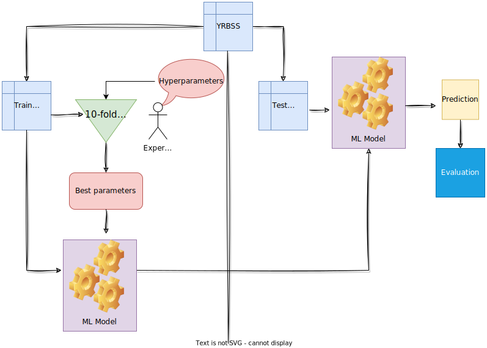

# Tidymodels the Toy Flowchart

This project is designed to test the flowchart that includes the set of functions used in a `tidymodels` analysis pipeline.

If this one works, the real project will include enhanced documentation including links to Julia Silge's vlogs.  

So CROSS YOUR FINGERS!

### Current Status:
* The toy worflow works in: https://rpubs.com/ccani007/1036433 
  * The YRBSS node links to a page with a description.
  * The Cross Validation node links to a page with a description.
  
## The toy flowchart

  
  
